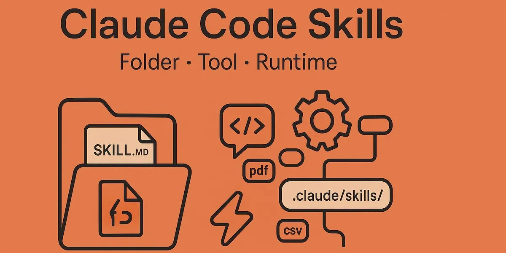

<div align="center">





<h1 align="center">skills-not-mcp</h1>
<p align="center"><i><b>80-90% fewer tokens with Skills + Shell vs MCP</b></i></p>

[![Github][github]][github-url]

</div>

<br/>

## Table of Contents

<ol>
    <a href="#about">About</a><br/>
    <a href="#conversion-table">Conversion</a><br/>
    <a href="#pattern">Pattern</a><br/>
    <a href="#how-to-build">How to build</a><br/>
    <a href="#usage">Usage</a><br/>
    <a href="#tools-used">Tools</a><br/>
    <a href="#contact">Contact</a>
</ol>

<br/>

## About

**80-90% token savings** by replacing MCP with Skills + Shell scripts.

18 MCP tools from [pal-mcp-server](https://github.com/BeehiveInnovations/pal-mcp-server) converted to:
- **Claude Skills** (`commands/*.md`) - slash command interface
- **Shell scripts** (`scripts/*.sh`) - actual execution

| approach | tokens loaded | savings |
|----------|---------------|---------|
| MCP (18 tools) | ~12,500 always | baseline |
| Skills + Shell | ~50 per call | **80-90%** |

MCP loads all 18 tool schemas (~700 tokens each) into context whether you use them or not.

Skills + Shell loads nothing until called - then only the output.

## Conversion Table

| # | MCP (before) | Skill (after) | Shell (after) |
|---|--------------|---------------|---------------|
| 1 | `tools/chat.py` | `commands/chat.md` | `scripts/chat.sh` |
| 2 | `tools/thinkdeep.py` | `commands/thinkdeep.md` | `scripts/thinkdeep.sh` |
| 3 | `tools/consensus.py` | `commands/consensus.md` | `scripts/consensus.sh` |
| 4 | `tools/codereview.py` | `commands/codereview.md` | `scripts/codereview.sh` |
| 5 | `tools/debug.py` | `commands/debug.md` | `scripts/debug.sh` |
| 6 | `tools/planner.py` | `commands/planner.md` | `scripts/planner.sh` |
| 7 | `tools/analyze.py` | `commands/analyze.md` | `scripts/analyze.sh` |
| 8 | `tools/refactor.py` | `commands/refactor.md` | `scripts/refactor.sh` |
| 9 | `tools/testgen.py` | `commands/testgen.md` | `scripts/testgen.sh` |
| 10 | `tools/secaudit.py` | `commands/secaudit.md` | `scripts/secaudit.sh` |
| 11 | `tools/docgen.py` | `commands/docgen.md` | `scripts/docgen.sh` |
| 12 | `tools/apilookup.py` | `commands/apilookup.md` | `scripts/apilookup.sh` |
| 13 | `tools/challenge.py` | `commands/challenge.md` | `scripts/challenge.sh` |
| 14 | `tools/tracer.py` | `commands/tracer.md` | `scripts/tracer.sh` |
| 15 | `tools/clink.py` | `commands/clink.md` | `scripts/clink.sh` |
| 16 | `tools/precommit.py` | `commands/precommit.md` | `scripts/precommit.sh` |
| 17 | `tools/listmodels.py` | `commands/listmodels.md` | `scripts/listmodels.sh` |
| 18 | `tools/version.py` | `commands/version.md` | `scripts/version.sh` |

**Source:** [pal-mcp-server](https://github.com/BeehiveInnovations/pal-mcp-server)

## Pattern

**Deterministic Delegation** - Skills orchestrate, Shell executes

```
┌─────────────────────────────────────────────────────────────┐
│                    MCP APPROACH                             │
│                                                             │
│  ┌────────┐ ┌────────┐ ┌────────┐ ┌────────┐              │
│  │ tool 1 │ │ tool 2 │ │ tool 3 │ │ ...18  │              │
│  │ ~700   │ │ ~700   │ │ ~700   │ │ tokens │              │
│  └────────┘ └────────┘ └────────┘ └────────┘              │
│                                                             │
│  COST: ~12,500 tokens ALWAYS LOADED                        │
│  SAVINGS: 0%                                                │
└─────────────────────────────────────────────────────────────┘

┌─────────────────────────────────────────────────────────────┐
│            SKILLS + SHELL (Deterministic Delegation)        │
│                                                             │
│  ┌────────┐                                                 │
│  │ /skill │ ────> shell script ────> output                │
│  │ ~50 tok│       (external)         (only this)           │
│  └────────┘                                                 │
│                                                             │
│  COST: ~50 tokens + output only                            │
│  SAVINGS: 80-90%                                            │
└─────────────────────────────────────────────────────────────┘
```

**flow:**
```
USER                    AI                      SHELL
 │                       │                        │
 │  "/chat review this"  │                        │
 │ ───────────────────>  │                        │
 │                       │  exec chat.sh          │
 │                       │ ────────────────────>  │
 │                       │                        │
 │                       │      ┌─────────────────┤
 │                       │      │ - parse args    │
 │                       │      │ - detect model  │
 │                       │      │ - call API      │
 │                       │      │ - format output │
 │                       │      └─────────────────┤
 │                       │                        │
 │                       │  JSON result           │
 │                       │ <────────────────────  │
 │                       │                        │
 │  formatted response   │                        │
 │ <───────────────────  │                        │
```

**layers:**
```
┌────────────────────────────────────────────────┐
│  LAYER 1: SKILL (orchestrator)                 │
│  commands/*.md                                 │
│  - slash commands, routing, ~50 tokens each    │
└────────────────────────────────────────────────┘
                    │ delegates to
                    ▼
┌────────────────────────────────────────────────┐
│  LAYER 2: SHELL (execution)                    │
│  scripts/*.sh                                  │
│  - actual logic, 0 tokens til called           │
└────────────────────────────────────────────────┘
                    │ calls
                    ▼
┌────────────────────────────────────────────────┐
│  LAYER 3: PROVIDER (external)                  │
│  Anthropic / OpenAI / Ollama / etc             │
└────────────────────────────────────────────────┘
```

| property | MCP | Skills + Shell |
|----------|-----|----------------|
| schema loading | always (~12.5k) | never |
| token savings | 0% | **80-90%** |
| execution | probabilistic | deterministic |
| debugging | opaque | `bash -x script.sh` |

## How to build

```bash
git clone https://github.com/vdutts7/skills-not-mcp.git
cd skills-not-mcp/scripts
```

API keys:
```bash
export ANTHROPIC_API_KEY="sk-..."
export CEREBRAS_API_KEY="..."
# or local Ollama (no key)
```

## Usage

```bash
# claude
./chat.sh -m claude-sonnet-4-20250514 "structure this API?"

# ollama (free/local)
./chat.sh -m qwen2.5-coder:7b "review this"

# file context
./chat.sh -f src/main.py -f src/utils.py "explain flow"

# multi-turn
./chat.sh -c sess1 "design cache"
./chat.sh -c sess1 "redis vs memcached?"

# code review
./codereview.sh -m llama-3.3-70b -f src/auth.py

# demo
./demo.sh
```

| | provider | models | env |
|:---:|----------|--------|-----|
|  | Anthropic | sonnet-4, opus-4 | `ANTHROPIC_API_KEY` |
|  | Cerebras | llama-3.3-70b, qwen-3-32b | `CEREBRAS_API_KEY` |
|  | Ollama | qwen2.5-coder, llama, mistral | local |
|  | OpenAI | gpt-4o, o1, o3 | `OPENAI_API_KEY` |
|  | Gemini | 2.0-flash | `GEMINI_API_KEY` |
|  | OpenRouter | any | `OPENROUTER_API_KEY` |

## Tools

[![Zsh][zsh-badge]][zsh-url]
[![jq][jq-badge]][jq-url]
[![curl][curl-badge]][curl-url]
[![Claude][claude-badge]][claude-url]
[![MCP][mcp-badge]][mcp-url]
[![SKILL.md][skill-badge]][skill-url]

## Contact

[![Email][email]][email-url]
[![Twitter][twitter]][twitter-url]

<!-- BADGES -->
[github]: https://img.shields.io/badge/skills--not--mcp-000000?style=for-the-badge
[github-url]: https://github.com/vdutts7/skills-not-mcp
[zsh-badge]: https://img.shields.io/badge/Zsh-000000?style=for-the-badge&logo=gnu-bash&logoColor=white
[zsh-url]: https://www.zsh.org/
[jq-badge]: https://img.shields.io/badge/jq-000000?style=for-the-badge
[jq-url]: https://jqlang.github.io/jq/
[curl-badge]: https://img.shields.io/badge/curl-000000?style=for-the-badge&logo=curl&logoColor=white
[curl-url]: https://curl.se/
[claude-badge]: https://img.shields.io/badge/Claude-000000?style=for-the-badge&logo=anthropic&logoColor=white
[claude-url]: https://claude.ai/
[mcp-badge]: https://img.shields.io/badge/MCP-000000?style=for-the-badge
[mcp-url]: https://modelcontextprotocol.io/
[skill-badge]: https://img.shields.io/badge/SKILL.md-000000?style=for-the-badge
[skill-url]: https://docs.anthropic.com/en/docs/agents-and-tools/claude-code/skills
[email]: https://img.shields.io/badge/Email-000000?style=for-the-badge&logo=Gmail&logoColor=white
[email-url]: mailto:me@vd7.io
[twitter]: https://img.shields.io/badge/Twitter-000000?style=for-the-badge&logo=Twitter&logoColor=white
[twitter-url]: https://x.com/vdutts7
