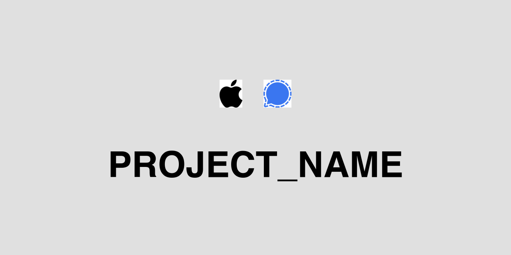

<div align="center">

<!-- ICONS: Add your icons here, hosted on Cloudinary or use relative paths -->
<!--  -->
<!--  -->

<h1 align="center">PROJECT_NAME</h1>
<p align="center"><i><b>One-liner description here.</b></i></p>

[![Github][github]][github-url]



</div>

<br/>

## Table of Contents

<ol>
    <a href="#about">📝 About</a><br/>
    <a href="#how-to-build">💻 How to build</a><br/>
    <a href="#next-steps">🚀 Next steps</a><br/>
    <a href="#tools-used">🔧 Tools used</a><br/>
    <a href="#contact">👤 Contact</a>
</ol>

<br/>

## 📝About

Brief description.

## 💻How to build

```bash
git clone https://github.com/vdutts7/PROJECT_NAME.git
cd PROJECT_NAME
```

## 🚀Next steps

- [ ] TODO

## 🔧Tools Used

[![Example][example-badge]][example-url]

## 👤Contact

[![Email][email]][email-url]
[![Twitter][twitter]][twitter-url]

<!-- BADGES -->
[example-badge]: https://img.shields.io/badge/Example-000000?style=for-the-badge
[example-url]: https://example.com
[github]: https://img.shields.io/badge/💻_Github-000000?style=for-the-badge
[github-url]: https://github.com/vdutts7/PROJECT_NAME
[email]: https://img.shields.io/badge/me@vd7.io-FFCA28?style=for-the-badge&logo=Gmail&logoColor=00bbff&color=black
[email-url]: #
[twitter]: https://img.shields.io/badge/Twitter-FFCA28?style=for-the-badge&logo=Twitter&logoColor=00bbff&color=black
[twitter-url]: https://twitter.com/vdutts7/
